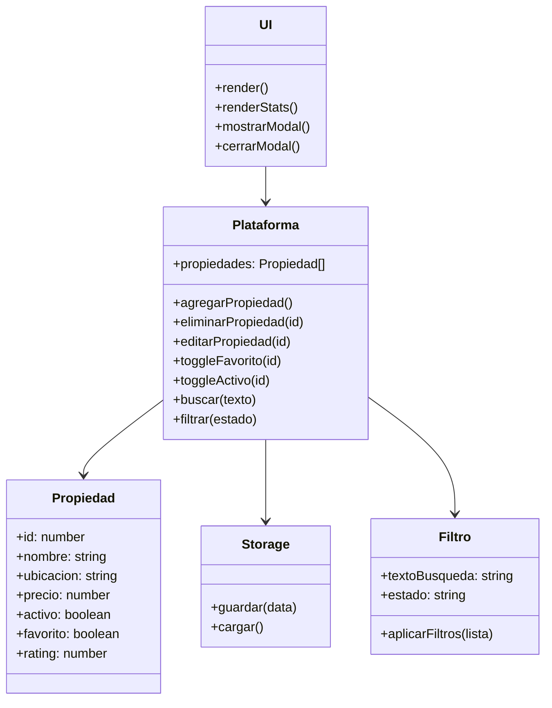

# 📊 Diagrama de Clases

```mermaid
classDiagram

class Propiedad {
  +id: number
  +nombre: string
  +ubicacion: string
  +precio: number
  +activo: boolean
  +favorito: boolean
  +rating: number
}

class Plataforma {
  +propiedades: Propiedad[]
  +agregarPropiedad()
  +eliminarPropiedad(id)
  +editarPropiedad(id)
  +toggleFavorito(id)
  +toggleActivo(id)
  +buscar(texto)
  +filtrar(estado)
}

class UI {
  +render()
  +renderStats()
  +mostrarModal()
  +cerrarModal()
}

class Storage {
  +guardar(data)
  +cargar()
}

class Filtro {
  +textoBusqueda: string
  +estado: string
  +aplicarFiltros(lista)
}

Plataforma --> Propiedad
Plataforma --> Storage
Plataforma --> Filtro
UI --> Plataforma
```